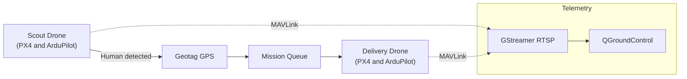

# Hi, I'm Vikas

 Hackathon Winner • AI/ML • Computer Vision • Robotics & Agentic Systems

 

<!-- Neon divider (image-based for GitHub compatibility) -->

<!-- Visual dashboard -->

—

I’m a high-throughput CS engineer (3rd year) building production-grade, cross-domain AI systems that bridge machine intelligence, autonomous robotics, and platform engineering. My trajectory is evolving from student innovator to emerging deep-tech architect — owning the path from dataset to deployment, from model to mission.

—

## What I’m Building

 -  AI-Powered Multimodal Agents for agriculture and rural empowerment (voice/image/text, multilingual, offline-first)
 -  Dual-drone orchestration for disaster response (PX4/ArduPilot, MAVLink, KML routes, GStreamer RTSP)
 -  Virtual Try-On pipelines (pose estimation, cloth-human alignment, dynamic warping, rendering)
 -  Large-scale recommender systems (9,551-restaurant content-based pipeline: cleaning → encoding → features → evaluation)

## Core Engineering Strengths

- **Computer Vision**: YOLOv8/YOLOv11 (detection, segmentation, pose, OBB, classification), real-time edge inference
- **LLM & NLP**: Tokenization → pretraining → fine-tuning → eval; LangChain/LangGraph + Gradio for agentic experiences
- **Autonomy & Drones**: PX4, ArduPilot, Pixhawk 4, MAVLink/pymavlink, QGroundControl, KML, mission planning
- **Edge & Embedded**: Raspberry Pi bots, sensor fusion, control systems, decision logic for real-time movement
- **Platform & Product**: Docker/K8s, FastAPI, interactive UIs (Gradio, Tkinter/customtkinter), VS Code + GPU workflows

## Featured Projects

 -  AI Farmer Agent — multimodal agritech intelligence  
	`Python` • Voice/Image/Text • Multilingual NLU • Offline-first • [Repo](https://github.com/VIKASSAMVEL/farmer_ai_agent)
 -  TryOnAi — virtual try-on with pose + warp  
	`Python` • Pose alignment • Cloth warping • Rendering • [Repo](https://github.com/VIKASSAMVEL/TryOnAi)
 -  Deepfake Detection (Web) — applied detector with web UI  
	`HTML` • `Python`-ready backend • Practical pipeline • [Repo](https://github.com/VIKASSAMVEL/deepfake-detection-in-website)
 -  J.A.R.V.I.S — voice automation assistant  
	`Python` • Speech I/O • Workflows • [Repo](https://github.com/VIKASSAMVEL/J.A.R.V.I.S)
 -  SkillNexus — skills graph and role mapping  
	`JavaScript` • Data/UI • [Repo](https://github.com/VIKASSAMVEL/SkillNexus)
 -  Expense Tracker — minimal personal finance  
	`JavaScript` • UI/State • [Repo](https://github.com/VIKASSAMVEL/expense-tracker)

More repositories

- 🌐 Portfolio (TypeScript) — [my-portfolio](https://github.com/VIKASSAMVEL/my-portfolio)
-  Pharma Outbreak Predictor — [PharmaOutBreakPredictor](https://github.com/VIKASSAMVEL/PharmaOutBreakPredictor)
-  Kaggle NFL exploration — [kaggle-nfl](https://github.com/VIKASSAMVEL/kaggle-nfl)
-  Internship ML work — [Machine-Learning-internship](https://github.com/VIKASSAMVEL/Machine-Learning-internship)
-  Flask basics — [website-with-flask](https://github.com/VIKASSAMVEL/website-with-flask)
 -  SignSphere (contribution) — Indian Sign Language to Multilingual Translator  
	 [Repo](https://github.com/Darsh-KillerTech/SignSphere---Indian-Sign-Language-to-Multilingual-Translator-System)

## Project Gallery

<table>
	<tr>
		<td width="50%" valign="top">
			<h3><a href="https://github.com/VIKASSAMVEL/farmer_ai_agent">AI Farmer Agent</a></h3>
			
Multimodal agritech assistant: voice, image, text with offline-first design.

			
			
			
		</td>
		<td width="50%" valign="top">
			<h3><a href="https://github.com/VIKASSAMVEL/TryOnAi">TryOnAi</a></h3>
			
Virtual try‑on: pose alignment, cloth warping, and rendering pipeline.

			
			
			
		</td>
	</tr>
	<tr>
		<td width="50%" valign="top">
			<h3><a href="https://github.com/VIKASSAMVEL/deepfake-detection-in-website">Deepfake Detection (Web)</a></h3>
			
Practical deepfake detection exposed via a clean web interface.

			
			
		</td>
		<td width="50%" valign="top">
			<h3><a href="https://github.com/VIKASSAMVEL/SkillNexus">SkillNexus</a></h3>
			
Skills graph and role mapping with interactive UI.

			
			
		</td>
	</tr>
	<tr>
		<td width="50%" valign="top">
			<h3><a href="https://github.com/VIKASSAMVEL/J.A.R.V.I.S">J.A.R.V.I.S</a></h3>
			
Voice automation assistant with task workflows.

			
			
		</td>
		<td width="50%" valign="top">
			<h3><a href="https://github.com/VIKASSAMVEL/expense-tracker">Expense Tracker</a></h3>
			
Minimal personal finance tracker.

			
			
		</td>
	</tr>
</table>

##  Robotics & Drone Autonomy

- Dual-drone mission stack: 
	- Scout drone: autonomous survey → real-time human detection → geotag capture
	- Delivery drone: autonomous navigation to scout-fed GPS → automated payload drop
- Tooling: PX4, ArduPilot, Pixhawk 4, QGroundControl, MAVLink/pymavlink, GStreamer RTSP, KML routes

### Dual-Drone Mission Flow

##  Edge Autonomy & Embedded Bots

- Agricultural weed-detecting robot (YOLOv8 + Raspberry Pi + L298N) with full decision loop for movement control
- Universal path-detection and navigation system (camera + inference + optional obstacle sensors)

## Research & Academic Footprint

- Best Paper Awards at Kalasalingam University and PSR College
- Research across object detection, Indian Sign Language detection, railway gate automation, deepfake detection

##  Achievements

-  HackFinity 2025 — World’s first prompt-exclusive agentic AI hackathon (Winner)
-  SIMATS Agentic AI Hackathon — First prize
-  Multiple national-level hackathon wins (agile, time-critical delivery)

##  Tech Stack

	
	
	
	
	
	
	
	
	
	
	
	
	
	

### Visual Skill Map

	

## GitHub Stats

 

## Let’s Connect

- 
- 

- LinkedIn: https://linkedin.com/in/S.vikas-070106
- Email: vikassamvel123@gmail.com

—

If you’re building in AI/Robotics/Agentic Systems and want velocity with reliability, I’d love to collaborate.
